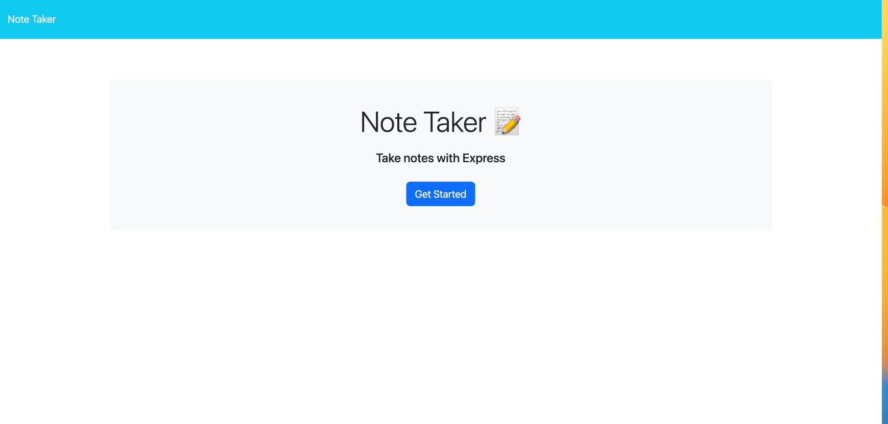
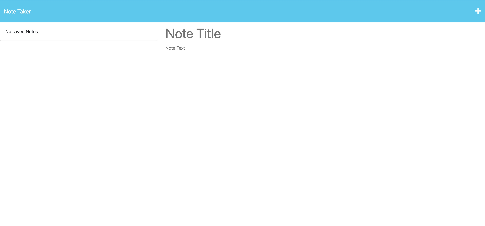

# gil-notetaker-app
## Description

This application allows users to write and save notes. The app was developed using express.js backend web application framework designed for building wep apps and API's. The note taker app while using the express.js backend will save and retrieve the notes from a json file name db.json (locate under the /db folder).

## Table of Contents
- [gil-notetaker-app](#gil-notetaker-app)
  - [Description](#description)
  - [Table of Contents](#table-of-contents)
  - [Installation](#installation)
  - [Usage](#usage)
  - [Contributing](#contributing)
  - [Contact Info](#contact-info)

## Installation 

Localhost Testing - local testing without a web server or PaaS like Heroku: 

First you should clone this repo (https://github.com/grosario1/gil-notetaker-app.git). You will need to ensure you install the npm utility and express.js framework in order for you test the app locally. You can follow the instructions to install the utility from here: https://docs.npmjs.com/downloading-and-installing-node-js-and-npm. Once, it is install, use the cmd to navigate to the repo you just cloned and run.... `node init -y` to initized the node js project, then install the express js package by running `npm install --save express` . From the directory where you clone the repo, you should see a server.js file, you can then run `node server.js` from the command line and then the express web app will start listening in your localhost on port 3001. The console will log `App listening at http://localhost:3001`

Add the url into the browser and the notetaker app/page will show up.
## Usage
As shown below, the user clicks on the 'Get Started' button which will route the user to the notes page and from there the user can add 'Note Title', add 'Note Text'. After adding Note Text, the user can save the note by clicking on the save icon  from the top right corner of the page.

- Example images of deployed Note Taker App:

## Contributing
The project is open for contributions. If you would like to contribute, create a new branch from the main and add any updates as deemed necessary. If you should find any issues with the code, please open a 'New Issue' from https://github.com/grosario1/gil-notetaker-app/issues and these request can be review and updated accordingly.
## Contact Info
For more questions, feel free to contact me:

- GitHub: https://github.com/grosario1
- Email: grosario@alum.quinnipiac.edu
